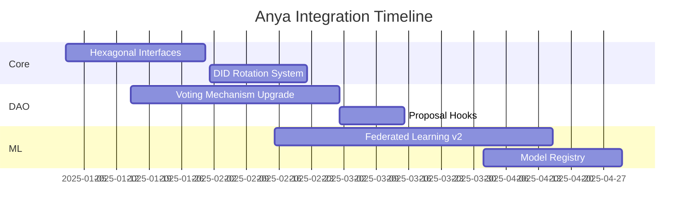

# OPSource TODO List

## Priority Tasks for anya-core Operational Status

### Critical (Immediate Implementation)
1. [x] Complete project infrastructure setup
2. [ ] Implement core Bitcoin protocol interfaces
   - [ ] Connect Bitcoin module stubs with implementation
   - [ ] Add UTXO management and coin selection
   - [ ] Implement transaction signing flow
3. [ ] Implement Web5 DWN integration
   - [ ] Implement DID resolver
   - [ ] Create DWN schema for blockchain data
4. [ ] Setup ML pipeline foundations
   - [ ] Implement ML service connectors
   - [ ] Setup secure model data flow
5. [ ] Create minimal viable enterprise features
   - [ ] Implement repository layer
   - [ ] Setup metrics collection

### High Priority (Required for MVP)
1. [ ] Formalize port interfaces for hexagonal architecture [@arch-team]
   - Deadline: 2025-Q1
   - Points: 13
   - Focus: Bitcoin protocol adapters

2. [ ] Implement DID rotation system [@web-team]
   - Interval: 90 days
   - Method: did:key rotation
   - Critical for security compliance

3. [ ] Set up federated node environment [@ml-team]
   - Nodes: 5 geo-distributed
   - TEE verification
   - Required for decentralized ML

### Medium Priority (Post-MVP Enhancement)
1. [ ] Implement sBTC mint/burn listeners [@stacks-team]
   - Deadline: 2025-Q1
   - Depends: Nakamoto testnet

2. [ ] Develop wrapped sBTC ↔ RGB bridge
   - Points: 8
   - Requires: Bitcoin SPV proofs

3. [ ] Create sBTC liquidity monitor
   - Metric: Reserve ratio alerts
   - Threshold: <90% collateral

4. [ ] Create DWN schema registry [@protocol]
   - Types: Metrics, Proposals, PSBTs

5. [ ] Setup quadratic voting system [@dao-team]
   - Depends: Token distribution
   - Snapshot integration

6. [ ] Implement proposal lifecycle hooks [@devs]
   - Pre/post-execution checks
   - Time-locked changes

7. [ ] Develop model version registry [@devops]
   - IPFS-based storage
   - ZK-proofs of training

## Deployment and Packaging Tasks
1. [ ] Create comprehensive test suite
   - [ ] Unit tests for core functionality
   - [ ] Integration tests for component interaction
   - [ ] Performance benchmarks

2. [ ] Setup CI/CD pipeline
   - [ ] Build automation
   - [ ] Test automation
   - [ ] Deployment automation

3. [ ] Create packaging scripts
   - [ ] Generate release artifacts
   - [ ] Create distribution packages
   - [ ] Setup version management

4. [ ] Documentation completion
   - [ ] API reference
   - [ ] Integration guides
   - [ ] Installation instructions

## Integration Timeline

## Component Status Tracking

| Component | Implementation | Testing | Documentation | Packaging |
|-----------|----------------|---------|---------------|-----------|
| Bitcoin   | 30%            | 10%     | 20%           | 0%        |
| Web5      | 20%            | 5%      | 15%           | 0%        |
| ML        | 25%            | 15%     | 10%           | 0%        |
| Enterprise| 15%            | 5%      | 10%           | 0%        |
| DAO       | 20%            | 10%     | 15%           | 0%        |

## Web5-Bitcoin Bridge
1. [ ] Implement DID:BTCR resolver [@web5-team]
   - Depends: Bitcoin Core 25+
   - Points: 3

2. [ ] Create DWN schema for PSBT
   - Versioned PSBT templates
   - Multi-sig coordination

3. [ ] Develop DID auth for Lightning
   - LNURL-auth integration
   - Web5 credential assertions

*Last updated: 2025-02-24*