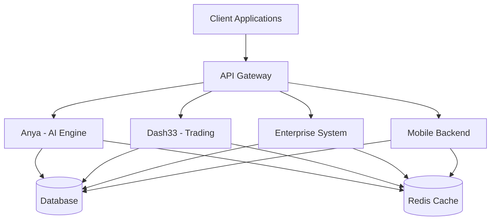
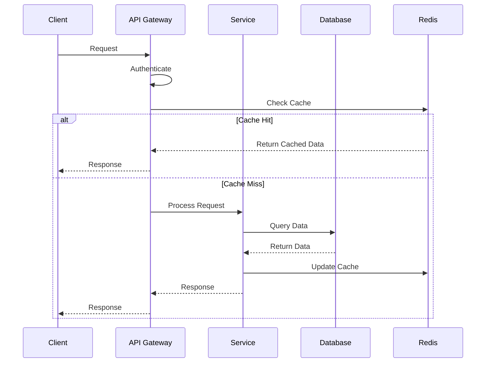
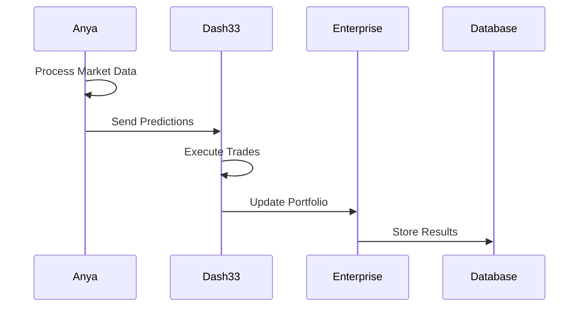
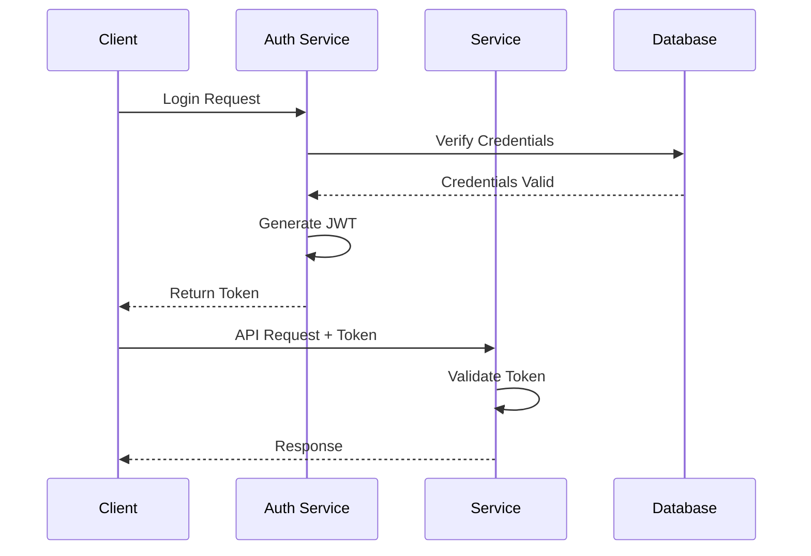
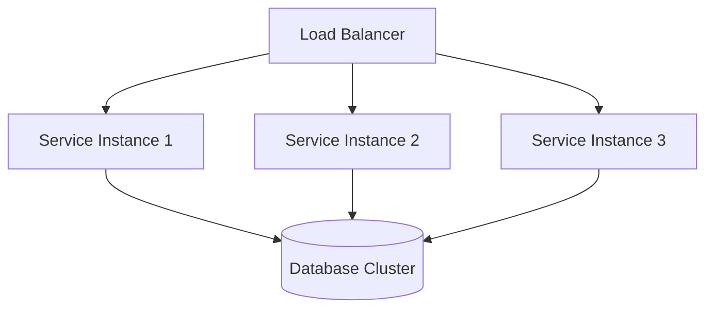
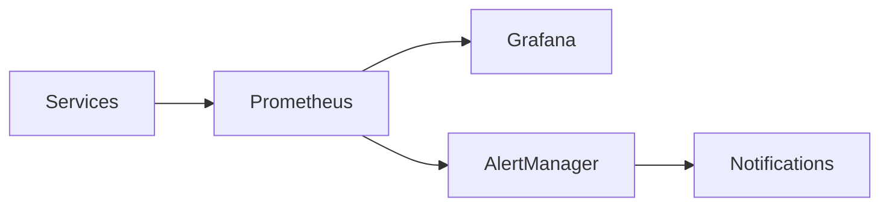
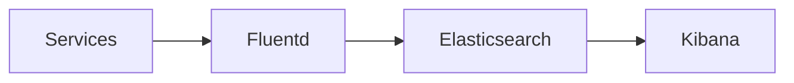
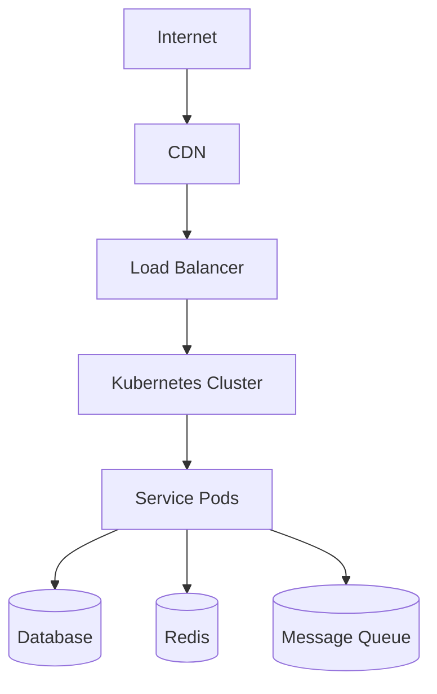

# OPSource Architecture Overview

## System Architecture

### High-Level Overview

OPSource is a distributed system composed of four main components:

1. **Anya** - AI/ML Processing Engine
2. **Dash33** - Blockchain Trading Platform
3. **Enterprise** - Business Process Management
4. **Mobile** - Mobile Integration Layer

 

### Component Details

#### 1. Anya (AI/ML Engine)

**Purpose**: Handles all AI/ML processing, including:
- Market prediction
- Risk assessment
- Pattern recognition
- Anomaly detection

**Key Components**:
- Model Training Pipeline
- Inference Engine
- Feature Store
- Model Registry

#### 2. Dash33 (Trading Platform)

**Purpose**: Manages blockchain trading operations:
- Order execution
- Market data processing
- Portfolio management
- Risk management

**Key Components**:
- Order Book Engine
- Market Data Processor
- Trading Engine
- Settlement System

#### 3. Enterprise System

**Purpose**: Handles business operations:
- User management
- Workflow processing
- Reporting
- Integration

**Key Components**:
- Authentication Service
- Workflow Engine
- Reporting Service
- Integration Hub

#### 4. Mobile Backend

**Purpose**: Supports mobile applications:
- API endpoints
- Push notifications
- Data synchronization
- Mobile-specific features

**Key Components**:
- Mobile API
- Notification Service
- Sync Engine
- Mobile Security

## Data Flow

### 1. Request Flow

### 2. Data Processing Flow

## Technical Stack

### Backend Services

- **Language**: Rust
- **Framework**: Actix-web
- **Database**: PostgreSQL
- **Cache**: Redis
- **Message Queue**: RabbitMQ

### AI/ML Stack

- **Framework**: PyTorch
- **Data Processing**: Pandas
- **Feature Store**: Redis
- **Model Registry**: MLflow

### Infrastructure

- **Container**: Docker
- **Orchestration**: Kubernetes
- **CI/CD**: GitHub Actions
- **Monitoring**: Prometheus/Grafana

## Security Architecture

### Authentication Flow

### Security Layers

1. **Network Security**
   - TLS/SSL encryption
   - VPN access
   - Network segregation

2. **Application Security**
   - JWT authentication
   - Role-based access control
   - Input validation
   - Rate limiting

3. **Data Security**
   - Encryption at rest
   - Encryption in transit
   - Secure key management

4. **Infrastructure Security**
   - Container security
   - Network policies
   - Security groups

## Scalability

### Horizontal Scaling

### Vertical Scaling

- Database optimization
- Cache utilization
- Resource allocation

## Monitoring and Observability

### Metrics Collection

### Logging

## Deployment Architecture

### Production Environment

### Development Environment

- Local development setup
- Testing environment
- Staging environment
- CI/CD pipeline

## Disaster Recovery

### Backup Strategy

1. **Database Backups**
   - Full daily backups
   - Incremental backups
   - Point-in-time recovery

2. **Application State**
   - Configuration backups
   - State persistence
   - Recovery procedures

### Recovery Procedures

1. **Service Recovery**
   - Automated failover
   - Manual intervention procedures
   - Data consistency checks

2. **Data Recovery**
   - Backup restoration
   - Data validation
   - Service verification

## Future Architecture

### Planned Improvements

1. **Scalability**
   - Enhanced load balancing
   - Improved caching
   - Database sharding

2. **Performance**
   - Query optimization
   - Cache strategy updates
   - Resource allocation

3. **Security**
   - Zero trust architecture
   - Enhanced encryption
   - Security automation

### Integration Points

1. **External Systems**
   - API integrations
   - Data exchange
   - Security protocols

2. **Internal Systems**
   - Service mesh
   - Event bus
   - Shared services
