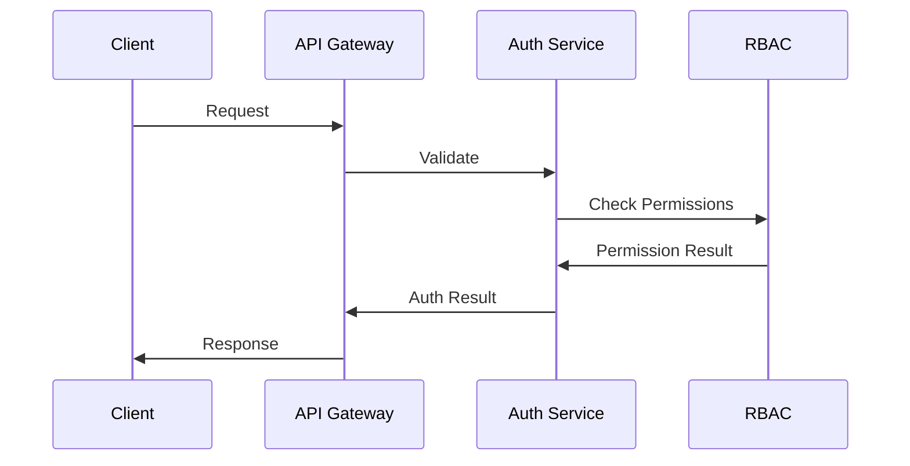
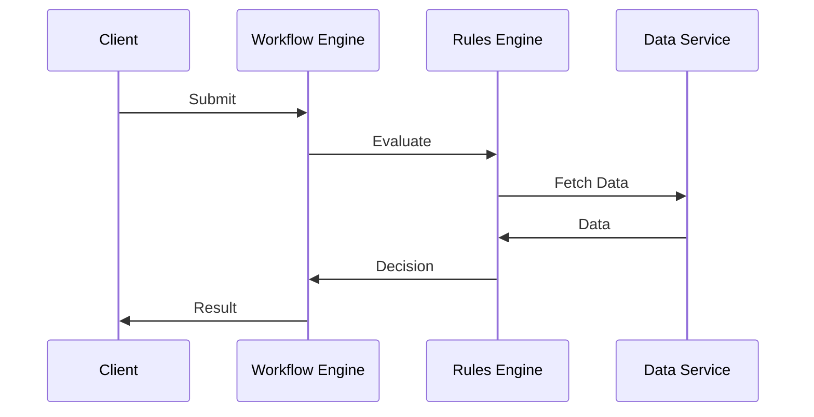

# Enterprise Architecture Documentation

## System Overview

The Enterprise component is built on a modular, scalable architecture designed for high availability and performance.

## Architecture Layers

### 1. Presentation Layer

```
presentation/
├── web/
│   ├── admin/
│   ├── dashboard/
│   └── reports/
├── api/
│   ├── rest/
│   ├── graphql/
│   └── grpc/
└── integrations/
    ├── external/
    └── plugins/
```

#### Key Components
- Web Interface
- API Gateway
- Integration Endpoints

### 2. Business Layer

```
business/
├── workflow/
│   ├── engine/
│   ├── definitions/
│   └── executors/
├── rules/
│   ├── engine/
│   ├── definitions/
│   └── evaluators/
└── services/
    ├── auth/
    ├── rbac/
    └── analytics/
```

#### Key Components
- Workflow Engine
- Rules Engine
- Business Services

### 3. Data Layer

```
data/
├── persistence/
│   ├── primary/
│   └── cache/
├── integration/
│   ├── connectors/
│   └── transformers/
└── analytics/
    ├── warehouse/
    └── metrics/
```

#### Key Components
- Data Storage
- Integration Services
- Analytics Engine

## Component Interactions

### Authentication Flow


### Workflow Processing


## System Requirements

### Hardware Requirements
- CPU: 4+ cores
- RAM: 16GB minimum
- Storage: 100GB+ SSD
- Network: 1Gbps

### Software Requirements
- OS: Linux/Windows Server
- Database: PostgreSQL 13+
- Cache: Redis 6+
- Message Queue: RabbitMQ

## Scalability

### Horizontal Scaling
- Service replication
- Load balancing
- Distributed caching
- Sharded databases

### Vertical Scaling
- CPU optimization
- Memory management
- Storage optimization
- Network tuning

## High Availability

### Redundancy
- Service redundancy
- Data replication
- Backup systems
- Failover mechanisms

### Monitoring
- System metrics
- Service health
- Performance metrics
- Error tracking

## Security Architecture

### Authentication
- Multi-factor auth
- Token management
- Session control
- Access logging

### Authorization
- Role-based access
- Permission management
- Policy enforcement
- Audit trails

### Data Security
- Encryption at rest
- Encryption in transit
- Key management
- Data masking

## Integration Architecture

### External Systems
- API integration
- Data exchange
- Protocol support
- Security measures

### Internal Systems
- Service mesh
- Event bus
- Message queue
- Cache layer

## Development Architecture

### Development Environment
- Local setup
- Testing environment
- Staging environment
- Production environment

### CI/CD Pipeline
- Code validation
- Automated testing
- Deployment automation
- Release management

## Monitoring Architecture

### System Monitoring
- Resource usage
- Service health
- Performance metrics
- Error tracking

### Business Monitoring
- KPI tracking
- Usage analytics
- User metrics
- Business metrics

## Disaster Recovery

### Backup Strategy
- Data backups
- System backups
- Configuration backups
- Recovery procedures

### Recovery Plans
- Service recovery
- Data recovery
- System recovery
- Business continuity

## Performance Optimization

### Caching Strategy
- Application cache
- Database cache
- API cache
- Content cache

### Query Optimization
- Index management
- Query tuning
- Data partitioning
- Connection pooling

## Future Considerations

### Scalability
- Service mesh adoption
- Container orchestration
- Cloud-native features
- Microservices evolution

### Technology
- New frameworks
- Better tools
- Improved security
- Enhanced performance
