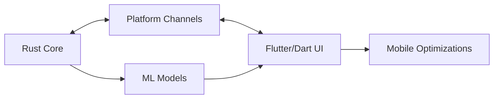

# Cross-Platform Integration Patterns

## Overview

This document outlines the integration patterns used in the OPSource project for cross-platform ML agent communication between Rust and Flutter/Dart.

## Architecture

### 1. Platform Channel Communication



[Rust Core] <-> [Platform Channels] <-> [Flutter/Dart UI]
     |                                         |
[ML Models] <------------------------> [Mobile Optimizations]

```

### 2. Component Layers

#### Rust Core (anya-core)

- MLAgentSystem: Core ML agent implementation
- MobileBridge: Platform channel interface
- State Management: Thread-safe state handling

#### Flutter/Dart (mobile)

- MLPlatformHandler: Platform channel management
- MLOptimizer: Mobile-specific optimizations
- AgentBridge: High-level API interface

## Integration Patterns

### 1. Message Passing

- Use structured message types for all cross-platform communication
- Implement serialization on both sides
- Handle errors gracefully with proper error types

Example:

```dart
// Dart side
class MLEvent {
  final String type;
  final Map<String, dynamic> data;
  final DateTime timestamp;
}

// Rust side
pub struct MLEvent {
    pub event_type: String,
    pub data: serde_json::Value,
    pub timestamp: chrono::DateTime<chrono::Utc>,
}
```

### 2. Resource Management

- Check device capabilities before heavy operations
- Implement batching for better performance
- Monitor battery and network conditions
- Use chunked processing for large data

Example:

```dart
class MLOptimizer {
  Future<bool> shouldExecute(MLAction action) async {
    // Check device capability
    // Check battery level
    // Check network status
    return conditions_met;
  }
}
```

### 3. State Synchronization

- Use atomic operations for state updates
- Implement versioning for model updates
- Handle concurrent access safely

Example:

```rust
pub struct MobileBridge {
    ml_core: Arc<Mutex<MLCore>>,
    agent_coordinator: Arc<Mutex<AgentCoordinator>>,
}
```

### 4. Platform Error Handling

- Define clear error types
- Propagate errors across platform boundary
- Implement recovery mechanisms

Example:

```dart
class MLAgentException implements Exception {
  final String message;
  MLAgentException(this.message);
}
```

### 5. Testing Strategy

- Unit tests for each component
- Integration tests for cross-platform communication
- Performance testing for mobile optimizations

## DAO Best Practices

### 1. Performance

- Use isolates for heavy computation in Dart
- Implement batching for network operations
- Optimize model size for mobile devices
- Cache results when appropriate

### 2. Security

- Validate all cross-platform messages
- Implement secure key storage
- Use encryption for sensitive data
- Verify model integrity

### 3. Resource Management

- Monitor memory usage
- Implement proper cleanup
- Handle background/foreground transitions
- Manage battery usage

### 4. Error Recovery

- Implement retry mechanisms
- Handle network failures gracefully
- Provide fallback behaviors
- Log errors for debugging

## Implementation Guide

### 1. Setting Up Platform Channels

```dart
static const platform = MethodChannel('com.opsource.anya/ml_agent');
```

### 2. Implementing Message Handlers

```dart
Future<dynamic> _handleMethodCall(MethodCall call) async {
  switch (call.method) {
    case 'processObservations':
      // Handle observation processing
      break;
    // ... other cases
  }
}
```

### 3. Managing Resources

```dart
class MLOptimizer {
  Future<bool> shouldUpdateModels() async {
    // Check conditions
    return conditions_met;
  }
}
```

### 4. Error Handling

```dart
try {
  await platform.invokeMethod('method_name', args);
} on PlatformException catch (e) {
  // Handle platform-specific errors
} catch (e) {
  // Handle general errors
}
```

## Versioning and Updates

### Model Updates

1. Check for updates on app start
2. Download updates in background
3. Verify integrity
4. Apply updates atomically

### Version Compatibility

- Maintain backward compatibility
- Version all messages and models
- Implement migration paths

## Monitoring and Debugging

### Logging

- Implement structured logging
- Log cross-platform communication
- Track performance metrics

### Performance Monitoring

- Track message latency
- Monitor resource usage
- Profile critical paths

## Future Considerations

### Scalability

- Plan for increased model complexity
- Consider distributed processing
- Prepare for multiple ML models

### Maintenance

- Document all integration points
- Maintain test coverage
- Review performance regularly

## References

- [Flutter Platform Channels](https://flutter.dev/docs/development/platform-integration/platform-channels)
- [Rust FFI](https://doc.rust-lang.org/nomicon/ffi.html)
- [TensorFlow Lite](https://www.tensorflow.org/lite)

## DAO Integration Patterns

## DAO Contract Integration

### Core Patterns

1. **Token Management**

   ```clarity
   (define-trait token-trait
     ((mint-tokens (uint principal) (response uint uint))
      (burn-tokens (uint principal) (response uint uint))))
   ```

2. **Proposal System**

   ```clarity
   (define-map proposals
     { proposal-id: uint }
     { title: (string-ascii 256),
       description: (string-utf8 4096),
       proposer: principal,
       status: (string-ascii 12) })
   ```

### Integration Points

- **Contract Calls**

  ```clarity
  (contract-call? .dao-core submit-proposal 
    title description blocks)
  ```

- **Event Hooks**

  ```clarity
  (define-public (on-proposal-created (id uint))
    (ok true))
  ```

## File Structure

```plaintext
src/core/dao/
├── contracts/
│   ├── dao-core.clar       # Core DAO functionality
│   ├── proposal.clar       # Proposal management
│   └── token.clar          # Token implementation
├── tests/
│   └── integration/        # Integration test suite
└── traits/                 # Shared contract traits
```

## Development Flow

1. Local Development

   ```bash
   clarinet test
   ```

2. Integration Testing

   ```bash
   npm run test:integration
   ```

3. Deployment

   ```bash
   clarinet deploy
   ```

## Common Integration Patterns

- Contract-to-Contract Calls
- Event Emission and Handling
- State Management
- Error Handling

## Best Practices

1. Use traits for interface definitions
2. Implement event hooks
3. Follow error code conventions
4. Document public functions
5. Include integration tests
